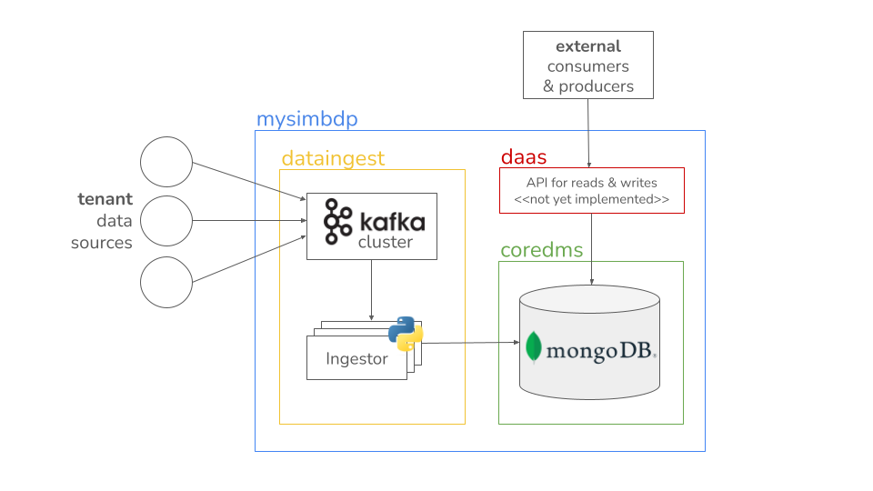
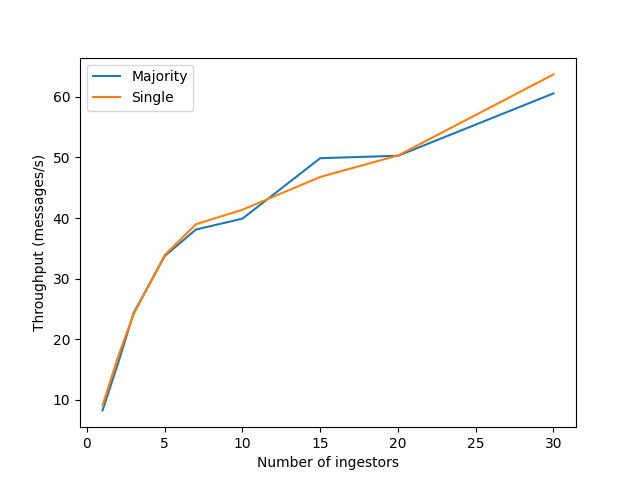
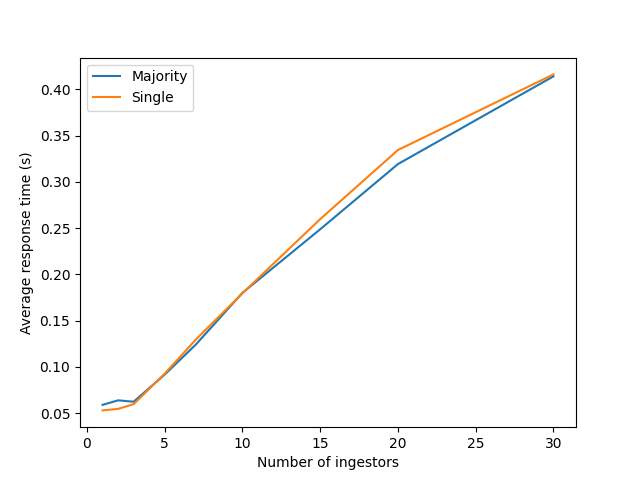

# Assignment report

## Part 1: Design

_1. Explain your choice of the application domain and generic types of data to be supported and
technologies for ``mysimbdp-coredms``. Explain your assumption about the tenant data sources and
how one could get data from the sources. Explain under which situations/assumptions, your platform
serves for big data workload. (1 point)_

I chose
the [open dataset about air quality monitoring from Germany](https://github.com/opendata-stuttgart/meta/wiki/EN-APIs) as
a basis for this assignment.

In this scenario, the tenant is looking for a big data platform that allows them to ingest data sent by thousands of
sensors across Europe and the world in real-time. Due to the large number of sensors and the high frequency of updates
the client is looking for a platform that can handle a high throughput of data and store large volumes of it. The
sensors emit their data in a semi-structured format. Even though the data schema is relatively uniform at the moment,
it is likely that new devices will be added, so it is important for the tenant that the platform can handle changes in
the data schema flexibly and without hassle. There are large volumes of historical sensor data, which should be ingested
eventually; however, this is not a top priority requirement for the platform right now.

Based on this scenario, the assumptions can be summarized as follows: The data will be pushed by a large number of
client devices in a semi-structured format and should be ingested in real-time. High throughput must be expected.

[more concrete considerations in the next answer]

_2. Design and explain the interactions among main platform components in your architecture of
``mysimbdp``. Explain how would the data from the sources will be ingested into the platform. Explain
which would be the third parties (services/infrastructures) that you do not develop for your
platform. (1 point)_

With the above-mentioned scenario as a basis, I designed ``mysimbdp`` as shown below.



Tenant data sources (e.g. sensors) can ingest data into the ``coredms`` by sending data to a ``Kafka``
cluster. From there, `Ingestor` workers can consume the data and insert it into the `coredms` database powered by
a `MongoDB`replica set. Several `Ingestor` workers can be run in parallel if required. External producers
and consumers can write/read to the `coredms` through an API provided by the `daas` component (not yet implemented).

I picked ``Apache Kafka`` as a messaging system as it is designed for high throughput event driven messaging, which is
an ideal starting point in this
scenario. Client devices (producers) can easily connect to the cluster and send their data, which is safely stored until
can be ingested. It is also straightforward to scale out by adding more brokers if the volume of messages increases.
Currently, the platform does not have separate support for batch ingestion (e.g. for historical sensor data) but such
data could still be streamed and ingested measurement-by-measurement without any code changes.

For the data sink (`mysimbdp-coredms`) I chose ``MongoDB`` as it is document-based (which maps perfectly to the format
the sensor data comes in) and schemaless (providing flexibility and making it easy to add different types of devices to
the sensor network). With some light preprocessing, data that does not conveniently come in JSON format can also be
stored in an adequate way. Using a replica set (including a primary and at least one secondary), ``MongoDB`` also
provides good availability (though likely not as good as a fully distributed multi-master solution like Cassandra).

Both `Kafka` and the `MongoDB` can be deployed over several nodes provisioned from a IaaS cloud provider and mostly just
require configuration maintenance but no new code to be developed. The only component that actually needs to be
implemented
is the `Ingestor`; to some degree, this could probably also be outsourced using a `MongoDB-Kafka` connector.

The `daas` component is not yet implemented in this assignment but would also need to be developed as part of the
platform. It would provide an API for external clients to read and write data to the `coredms`.

_3. Explain a configuration of a cluster of nodes for ``mysimbdp-coredms`` so that you prevent a single-point-of-failure
problem for ``mysimbdp-coredms`` for your tenants. (1 point)_

If there is no sharding, then it would be sufficient to have a single replica set (see below). There might still be a
brief loss of availability during the time a new primary, but there is redundancy from a data perspective.

For sharded clusters it becomes more complicated since then there are more components to keep track of.
The [docs](https://www.mongodb.com/docs/manual/core/sharded-cluster-components/) suggest deploying the config server as
a 3-member replica set, each shard as a 3-member replica set, and at least one mongos router.

Additionally, it would be good to deploy the replicas across different data centers to provide redundancy in case a data
center goes offline.

_4. You decide a pre-defined level of data replication for your tenants/customers. Explain the level of
replication in your design, how many nodes are needed in the deployment of ``mysimbdp-coredms`` for
your choice so that this component can work property (e.g., the system still supports redundancy in
the case of a failure of a node). (1 point)_

The minimum configuration would be two nodes that hold the data (one of them the primary and one of them the secondary)
and one node that functions as the arbiter so that the secondary node can be elected primary in case the former primary
is not available. This case would equal to a replication factor of 2 (i.e. there are two nodes that hold the data). If
costs permit, it's also possible to just have two or more secondaries in addition to the primary
node (i.e. a replication factor of 3 or more).[1](https://www.mongodb.com/docs/manual/replication/)

_5. Consider the platform data center, the tenant data source locations and the network between them.
Explain where would you deploy ``mysimbdp-dataingest`` to allow your tenants using ``mysimbdp-dataingest`` to push
data into ``mysimbdp``, based on which assumptions you have. Explain the performance pros and cons of the deployment
place, given the possibilities you have. (1 point)_

As can be seen in the visualization [here](https://github.com/opendata-stuttgart/meta/wiki/EN-APIs), the tenant data
source locations are clustered heavily in Germany and neighbouring countries. For this tenant, I would therefore deploy
both ``dataingest`` and the ``coredms`` geographically close to the majority of the sensors/centroid of the cluster to
reduce network latency and therefore increase performance. If deployed on GCP, for example, a suitable region in this
case might be any of the europe-west3 ones, located in Frankfurt, Germany. For other tenants, I would apply a similar
logic.

If the data center where the `coredms` is deployed were fixed (and possibly located somewhere inconvenient), I
would still deploy ``dataingest`` close to the `coredms` as opposed to close to the data sources. My reasoning here
would be that the sensors will fire their measurements from time to time, but don't have to wait for a response. So if
the journey to the broker/ingestor has higher latency, the only effect will be that the data point will be ingested
slightly later; the `dataingest` component (that should actually make sure that the data point was inserted correctly)
can still work on a fast connection to the `coredms` at full capacity.

If I was looking at a situation where historical data should be ingested, another option could be to just
deploy ``dataingest`` on the tenant machine (in that case, `dataingest` would be e.g. an Apache Nifi workflow that reads
the data from disk and sends it to the `coredms`). That way, the data would only need to make one trip straight to
the `coredms` instead of one to `dataingest` and then to `coredms`.

## Part 2: Implementation

_1. Design, implement and explain one example of the data schema/structure for a tenant whose data
will be stored into ``mysimbdp-coredms``. (1 point)_

Given that the `coredms` is a `MongoDB` in this case, it uses a flexible schema. However, it's still possible to create
a collection with schema validation rules. For the tenant mentioned above I would create a collection `measurements`
that contains documents with the schema in [data/measurement_schema.json](../data/measurement_schema.json).

_2. Given the data schema/structure of the tenant (Part 2, Point 1), design a strategy for data
partitioning/sharding, explain the goal of the strategy (performance, data regulation and/or what),
and explain your implementation for data partitioning/sharding together with your design for
replication in Part 1, Point 4, in ``mysimbdp-coredms``. (1 point)_

Given that the example data is basically time series data and I think it would be likely that the number of data points
in
a given range of time would be (a) relatively evenly distributed over time and (b) it is likely that data points from
around the same time would be accessed together (e.g. to do some aggregation) I would do range-based sharding on
the `timestamp` field. The goal of the strategy would be improving the performance by keeping "similar" data points
together while allowing for better scalability. Each shard would then have its own 3-node replica set to make sure that
all the data is consistently available to a high degree.

_3. Assume that you are the tenant, emulate the data sources with the real selected dataset and write a
``mysimbdp-dataingest`` that takes data from your selected sources and stores the data into
``mysimbdp-coredms``. Explain what would be the atomic data element/unit to be stored. Explain
possible consistency options for writing data in your ``mysimdbp-dataingest``. (1 point)_

The data sources are emulated by running `sensor.py` (see [Deployment](Assignment-1-Deployment.md)). This script
emulates a sensor that sends data to a Kafka topic. The `dataingest` component (`ingestor.py`) then consumes the data
from the topic and inserts it into the `coredms`.

The atomic element to be stored is one measurement, which maps to one document in ``MongoDB``. As far as I understand
it,``MongoDB`` offers different levels of consistency based on different combinations of read and write concerns. For
writing, the main options would be...

* 0 (no acknowledgement),
* 1 (primary only),
* ``n`` (change has propagated to ``n`` instances), and
* majority (speaks for itself; I think it would be the equivalent of ``QUORUM`` in Cassandra).

Obviously, the "stricter" the requirements here the stronger the consistency guarantees will be, but at the same time
performance will degrade. For this use case, I would for example consider going with a write concern of 1, as it
probably wouldn't hurt too much if a single measurement was lost from time to time, whereas it would be important to be
able to ingest a high volume of measurements quickly.

_4. Given your deployment environment, measure and show the performance (e.g., response time,
throughputs, and failure) of the tests for 1,5, 10, .., n of concurrent ``mysimbdp-dataingest`` writing
data into ``mysimbdp-coredms`` with different speeds/velocities together with the change of the
number of nodes of ``mysimbdp-coredms``. Indicate any performance differences due to the choice of
consistency options. (1 point)_

I ran the tests against a local Kafka cluster with a MongoDB Atlas cluster as the `coredms` (see
also [performance_test.py](code/performance/performance_test.py) and [logs](logs/)). As shown below, the average
response time increased almost linearly with the number of concurrent ``ingestor``s. However, the throughput also
increased, though that increase might be more logarithmic. I did not observe any signigicant differences between using
majority vs primary write concern which I think makes sense as in my case there was only one secondary node that would
need to respond. I would expext that for a larger replication factor the response time would increase more noticeably.




_5. Observing the performance and failure problems when you push a lot of data into ``mysimbdp-coredms`` (you do not
need to worry about duplicated data in ``mysimbdp``), propose the change of your
deployment to avoid such problems (or explain why you do not have any problem with your
deployment). (1 point)_

I did not experience any problem on the `coredms` side; it appears that the standard configuration of the MongoDB
Atlas cluster I used was sufficient to handle the load. However, I did face issues with the ``ingestors`` that increased
for more parallel workers. In these cases, the worker would terminate without having received any data from Kafka.
However, I suspect that the problem might be with the way I implemented the performance tests and not with the cluster
or the `ingestor` itself.

## Part 3: Extension

_1. Using your ``mysimdbp-coredms``, a single tenant can run ``mysimbdp-dataingest`` to create many
different databases/datasets. The tenant would like to record basic lineage of the ingested data,
explain what types of metadata about data lineage you would like to support and how would you do
this. Provide one example of a lineage data. (1 point)_

Given that for now, the platform only supports storing data without any processing, it should be sufficient to store
very basic lineage data. This could include...

* the source of the data: in the example dataset it would be the sensor information; if data is ingested from a file or
  dataset it could be the source file name or dataset name.
* the insertion/creation timestamp,
* a last updated timestamp

Example (assuming the data is coming from a sensor):

````json
{
  "source": {
    "type": "sensor",
    "info": {
      "id": 26436,
      "pin": "11",
      "sensor_type": {
        "id": 17,
        "name": "BME280",
        "manufacturer": "Bosch"
      }
    }
  },
  "inserted": "2024-02-10 19:19:01",
  "last_updated": "2024-02-10 19:19:01"
}
````

For simple metadata like this and given that we're using document-based storage, it might be a good choice to just add
the metadata to the data point itself on ingestion. In the example, the sensor automatically sends metadata about
itself with each measurement; the Ingestor would just need to add the timestamps. For other data sources, it would work
similarly in that the desired source information needs to be transmitted with the data points.

For more complicated metadata or if there are processing pipelines in use it might make sense to create a separate
collection for metadata. The metadata document could then just reference the actual data point (or the other way around)
and contains information about when and how the data was processed.

_2. Assume that each of your tenants/users will need a dedicated ``mysimbdp-coredms``. Design the data
schema of service information for ``mysimbdp-coredms`` that can be published into an existing registry
(like ZooKeeper, consul or etcd) so that you can find information about which ``mysimbdp-coredms`` is
for which tenants/users. (1 point)_

Following the example from the tutorials, I would create a consul config as follows and just tag the service with the
tenant name. The service can then be registered with the consul agent. The tenant can query consul to find the
dedicated `coredms` for them.

```json
{
  "name": "mongodb",
  "tags": [
    "tenant1"
  ],
  "port": 27017,
  "address": "192.168.8.106",
  "check": { 
    // ...
  }
}
```

_3. Explain how you would change the implementation of ``mysimbdp-dataingest`` (in Part 2) to integrate
a service discovery feature (no implementation is required). (1 point)_

Given that a registry like consul is used and the `coredms`s are registered with it like above, I would pass the
respective tenant name to `dataingest` as a config parameter. It can then query the registry to find the correct
`coredms` to connect to.

_4. Assume that now only ``mysimbdp-daas`` can read and write data into ``mysimbdp-coredms``, how would
you change your ``mysimbdp-dataingest`` (in Part 2) to work with ``mysimbdp-daas``? (1 point)_

Given that `daas` is going to be some sort of web server, I would just change the `dataingest` to POST the data to
the `daas` API instead of directly inserting it into the `coredms`. The `daas` would then be responsible for writing
the data to the `coredms`.

_5. Assume that the platform allows the customer to define which types of data (and) that should be
stored in a hot space and which should be stored in a cold space in the ``mysimbdp-coredms``. Provide
one example of constraints based on characteristics of data for data in a hot space vs in a cold space.
Explain how would you support automatically moving/extracting data from a hot space to a cold
space. (1 point)_

Given the scenario used above, the tenant might be safe to assume that current data from the time series is accessed
much more frequently than older data. A constraint could therefore be: "Data that was inserted more than 30 days ago
will be moved to a cold space". To move the data, one could schedule a task at regular intervals that checks the hot
storage for stale data and takes care of moving it to cold storage.


